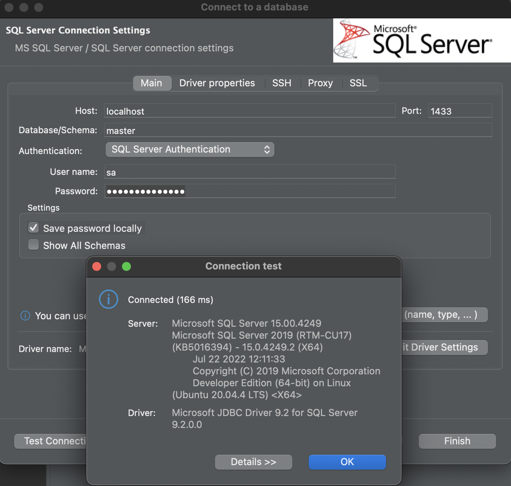

# MSSQL Server 2019 (Docker Compose)

# Usage
1. Clone this repository
2. Run `docker-compose up -d`
3. Connect to `sqlserver.localhost:1433` with your favorite SQL client
4. Login with `sa` and password `YourPassword`
    - Example:
        
5. You are done. Enjoy!